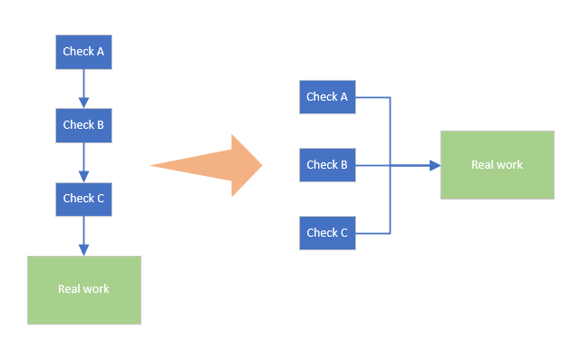

# parallelworker

this is a simple lib to do work parallel.

for example: you need do some check, called `check A`, `check B`, `check C`, and those check are not interdependent, so we can do those check at the same time



# Usage

1. make a `content`

```go
ctx := context.Background()
```

2. make `worker`

```go
worker := parallelworker.NewParallelWorker(ctx)
```

3. add all your `worker`

```go
worker.AddWorker(func(ctx context.Context) {
    select {
    	case <-ctx.Done():
            // if ctx is cancel, you should return your function
            return
        default:
    }
    // do something
})
```

4. wait for finish

   this function will be blocked, so you need add a timeout context to control it, this context is different from the first one

```go
timeOutCtx := context.WithTimeout(ctx, time.Second * 5)
worker.WaitContext(timeOutCtx)
```